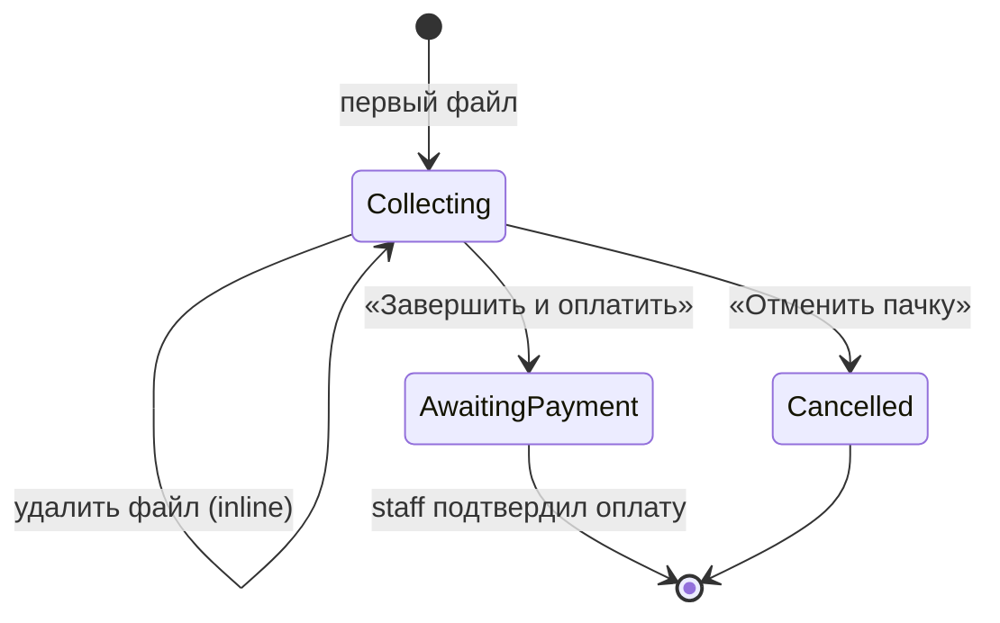

# Редактирование пачки перед отправкой на печать

> **Статус:** ✅ done (вариант C + edit статусов)  
> **Feature IDs:** UX-12 (расширение), FILE-01  
> **Связано:** [sprint-0-2](../sprints/sprint-0-2/README.md), [payment-flow.md](./payment-flow.md), [FEATURES.md](../project/FEATURES.md)

## Проблема

Сейчас пользователь собирает пачку, отправляя файлы по одному. Если он ошибся (не тот файл, дубликат, битый DOCX), единственный способ исправить один файл — **отменить всю пачку** и отправить всё заново.

Кнопка **«❌ Отменить пачку»** уже есть и закрывает весь сценарий целиком. Не хватает промежуточного действия: убрать **один** ошибочный файл, оставив остальные.

**Цели:**
1. Дать удалять отдельные файлы в пачке **до оплаты**. Замена = удалить файл + отправить новый.
2. Показывать клиенту, что бот **обрабатывает** действие (загрузка, подсчёт, удаление) — без лишних сообщений в чате.

---

## Решение (выбрано)

**Вариант C — кнопка на каждом сообщении о файле.**

К каждому сообщению «📎 Файл готов: …» добавляется inline-кнопка **`🗑 Удалить этот файл`**. Reply-клавиатура не меняется: «Завершить и оплатить» / «Отменить пачку» остаются как есть.

**Почему не «Моя пачка» (вариант A):** отдельная сводка дублирует то, что пользователь уже видит в ленте сообщений; при лимите 5 файлов это лишний экран. Сейчас достаточно точечного удаления рядом с конкретным файлом.

---

## Текущее состояние

| Компонент | Статус |
|-----------|--------|
| `OrderBatch.status = COLLECTING` — сбор файлов | ✅ |
| Кнопки «Завершить и оплатить» / «Отменить пачку» | ✅ |
| Лимит `BATCH_MAX_FILES` (по умолчанию 5) | ✅ |
| Таймаут `BATCH_BUILD_TIMEOUT_MIN` (15 мин) | ✅ |
| `finalizeBatch` → `AWAITING_PAYMENT` + staff-уведомление | ✅ |
| Удаление одного файла из пачки | ❌ |
| Редактирование после «Завершить и оплатить» | ❌ |
| Мгновенная реакция на отправку файла | ❌ (тишина до upload в Blob) |
| `editMessage` / typing indicator | ❌ |
| `answerCallback` на действия клиента | ⚠️ частично (staff + MAX batch-кнопки) |

### Когда редактирование допустимо

| Статус пачки | Удалить файл | Примечание |
|--------------|-------------|------------|
| `COLLECTING` | ✅ да | Основной сценарий |
| `AWAITING_PAYMENT` | ❌ нет | Точка невозврата для клиента; исправления через staff |
| `PAID` и далее | ❌ нет | Оплата принята |
| `CANCELLED` | — | Пачка закрыта |

---

## Детальный флоу (фаза 1)

### Сообщения с кнопкой и без

| Сообщение | Поведение |
|-----------|-----------|
| Слот файла (PDF) | `Принимаю…` → **edit** → `Файл готов` + `[🗑]` |
| Слот файла (Word) | `Принимаю…` → **edit** → `Считаем…` → **edit** → `Файл готов` + `[🗑]` |
| `formatBatchSummary` — после «Завершить» | Новое финальное сообщение (не edit) |
| Ошибка upload | **edit** слота файла в текст ошибки |
| Confirm удаления | **edit** сообщения файла (не новый пост) |

### Сбор пачки



### Пример диалога

```
Пользователь                    Бот (одно messageId на файл)
    │                            │
    │── договор.pdf ────────────►│ «📥 Принимаю договор.pdf…»
    │                            │  → edit: «📎 договор.pdf — 4 стр.» [🗑]
    │── заявление.docx ─────────►│ «📥 Принимаю заявление.docx…»
    │                            │  → edit: «⏳ Считаем страницы…»
    │                            │  → edit: «📎 заявление.docx — 12 стр.» [🗑]
    │── «Удалить» (на 1-м) ─────►│ edit: «Удалить договор.pdf?» [Да][Нет]
    │── «Да» ───────────────────►│ edit: «🗑 удалён» + toast «В пачке: 1»
    │── исправленный.pdf ───────►│ «📥 Принимаю…» → edit: готов [🗑]
    │── «Завершить и оплатить» ─►│ toast «Собираем…» → новое: formatBatchSummary
```

**Замена файла:** пользователь жмёт «Удалить» под нужным сообщением → отправляет новый документ. Новый файл добавляется в конец пачки (порядок печати может сдвинуться — для MVP допустимо).

### Удаление файла (сервер)

1. Callback `batch_remove:{orderId}` → подтверждение `batch_remove_confirm:{orderId}` / `batch_remove_cancel`.
2. Проверки:
   - пачка `COLLECTING`;
   - `order` принадлежит пачке и пользователю;
   - заказ не в `CALCULATING`.
3. `deleteOrderFile` → `order.status = FAILED`, `errorMessage = 'removed by user'`.
4. `reindexBatchOrders` → перенумерация `batchIndex` без дыр.
5. `recalculateBatchTotals`.
6. Если активных файлов **0** → `cancelBatch` (без дублирующего «пачка отменена», если пользователь сам всё удалил — короткий текст «Отправьте файл заново»).

### Старые кнопки в истории чата

Кнопки на прошлых сообщениях **остаются видимыми** — это нормально для MVP.

При нажатии на уже удалённый файл:
- идемпотентный ответ: «Этот файл уже удалён из пачки»;
- не показывать ошибку.

При нажатии после «Завершить и оплатить» или отмены пачки:
- «Пачка уже завершена» / «Пачка отменена».

---

## Обратная связь: клиент видит, что бот работает

### Проблема

Сейчас между действием пользователя и ответом бота часто **тишина 3–15 секунд**:

| Действие | Что происходит без ответа | Типичная задержка |
|----------|---------------------------|-------------------|
| Отправил PDF | `download` → `uploadOrderFile` (Blob) | 2–10 с |
| Отправил DOCX | то же + потом ещё подсчёт на ПК агента | 5–25 с |
| «Завершить и оплатить» (TG, reply-кнопка) | `finalizeBatch` + staff notify | 1–3 с |
| «Удалить этот файл» | проверки + Blob + reindex | 1–2 с |

Клиент не понимает: бот завис, файл не дошёл или идёт обработка.

Для DOCX сейчас **два отдельных сообщения** («Считаем…» → «Файл готов») — это лучше, чем ничего, но увеличивает шум в ленте.

### Принципы (без мусора в чате)

1. **Одна сущность — одно сообщение.** Жизненный цикл файла, диалог подтверждения удаления, итог пачки — каждый в **одном** messageId, состояния меняются через `editMessage`, а не новыми постами.
2. **Мгновенный ack на кнопки.** Любой callback: сначала `answerCallbackQuery` / `answerCallback` («Принято», «Удаляю…») — до тяжёлой логики. Telegram показывает toast вверху, отдельное сообщение не нужно.
3. **Typing / upload indicator** — только **до** первого сообщения с `messageId` (первые ~300 ms после webhook). Не крутить typing минутами.
4. **Новое сообщение** — только если нельзя отредактировать старое (ошибка, `/start`, уведомление после оплаты) или сущность новая (итог пачки после finalize — отдельное финальное сообщение ок).
5. **Не дублировать reply-клавиатуру** в каждом edit — клавиатура «Завершить / Отменить» остаётся на последнем *reply*-сообщении; inline-кнопки «Удалить» живут на сообщениях файлов.

### Модель: «слот сообщения» на файл

Каждый `Order` в пачке получает **одно клиентское сообщение**, которое проходит стадии:

```
📥 Принимаю «договор.pdf»…
        ↓ edit (после Blob)
📎 договор.pdf — 4 стр.          [PDF, сразу финал]
        или
⏳ Считаем страницы «заявление.docx»…
        ↓ edit (после calculation.post)
📎 заявление.docx — 12 стр.      [🗑 Удалить этот файл]
```

**Не отправлять** второе сообщение «Файл готов» для Word — **редактировать** то же, что «Принимаю» / «Считаем».

Для хранения `messageId` (нужно для edit из `notifyBatchFileCalculated`):

```prisma
// опционально на Order
clientMessageId   String?   // platform message id
clientMessageChat String?   // chat id для edit
```

Альтернатива без миграции: in-memory/Redis `orderId → messageId` — хуже на serverless (Vercel), предпочтительно поле в БД.

### Сценарии по действиям

#### 1. Пользователь отправил файл

```
[сразу]  sendMessage: «📥 Принимаю «{fileName}»…»
         + sendChatAction: upload_document (TG) / аналог MAX
[после Blob]
         editMessage → ready или «⏳ Считаем страницы…»
[после агента, Word]
         editMessage → «📎 Файл готов…» + inline [🗑]
```

Если upload упал — **edit** того же сообщения в «❌ Не удалось сохранить…», не новый пост.

#### 2. «Завершить и оплатить»

| Канал | Мгновенная реакция | Итог |
|-------|-------------------|------|
| **MAX** (inline callback) | `answerCallback('Собираем пачку…')` | Новое сообщение `formatBatchSummary` (финал, не редактируем) |
| **Telegram** (reply-текст) | `sendChatAction(typing)` + короткое «⏳ Собираем пачку…» **или** edit последнего status-сообщения | То же `formatBatchSummary`; status «Собираем…» можно **удалить** (`deleteMessage`) после успеха |

Два сообщения («Собираем» + «Пачка собрана») допустимы **только** на finalize — редкое действие, клиент ждёт итог.

#### 3. «Отменить пачку»

- Callback (MAX): `answerCallback('Отменяем…')` → одно сообщение «Пачка отменена».
- Reply (TG): typing → существующий `MSG_BATCH_CANCELLED` (без лишнего «Отменяем…», операция быстрая).

#### 4. «Удалить этот файл»

Предпочтительно **редактировать сообщение файла**, а не слать новое:

```
[исходное]
📎 договор.pdf — 4 стр.     [🗑 Удалить]

[после «Удалить»]
Удалить «договор.pdf»?       [Да, удалить] [Нет]

[после «Да»]
🗑 Удалён из пачки.          (кнопки сняты)

[после «Нет»]
📎 договор.pdf — 4 стр.     [🗑 Удалить]   ← откат текста и клавиатуры
```

Отдельное сообщение «Файл удалён. В пачке: N» — **не нужно**, если edit исходного достаточен. Счётчик «в пачке: N» — в footer следующего добавленного файла или в toast: `answerCallback('Удалено. В пачке: 2')`.

#### 5. Повторная отправка файла подряд

Не показывать второй «Принимаю…», пока не завершился предыдущий upload (очередь на чат). Иначе два параллельных status-сообщения. MVP: обрабатывать документы последовательно в рамках одного webhook-процесса (уже так); при гонке — «Подождите, обрабатываем предыдущий файл».

### Варианты реализации (сравнение)

| Подход | Плюсы | Минусы | Когда |
|--------|-------|--------|-------|
| **A. Edit слот на файл** (рекомендуется) | Минимум сообщений, ясный прогресс | Нужен `messageId` в БД, `editMessage` в адаптере | Фаза 1b вместе с удалением |
| **B. Только typing + toast** | Без миграции, 1–2 ч | Не видно имени файла / этапа | Быстрый hotfix до edit |
| **C. Новое сообщение на каждый этап** | Проще код | 3–5 постов на один DOCX — мусор | ❌ не использовать |
| **D. Одна «пин»-сводка на пачку** | Один edit для всего состава | Конфликт с вариантом C (кнопка на сообщении файла) | Отложено (вариант «Моя пачка») |

**Рекомендация:** **A + toast на callbacks**. Typing — только первые секунды до первого `sendMessage`.

### Расширение `MessengerAdapter`

```ts
interface MessengerAdapter {
  sendText(...)
  sendStatus?(target, text, options?) → { messageId: string }
  editStatus?(target, messageId, text, options?)
  sendTyping?(target, action: 'typing' | 'upload_document')
  answerInteraction?(interactionId, text?)  // callback ack
}
```

`options` для status/edit: `{ batchKeyboard?, inlineKeyboard?, removeKeyboard? }`.

### Тексты статусов (черновик)

```
MSG_FILE_RECEIVING = '📥 Принимаю «{fileName}»…'
MSG_FILE_CALCULATING = '⏳ Считаем страницы «{fileName}»…\nЭто может занять до 20 секунд.'
MSG_FILE_REMOVED_INLINE = '🗑 «{fileName}» удалён из пачки.'
MSG_BATCH_FINALIZING = '⏳ Собираем пачку…'
MSG_WAIT_PREVIOUS_FILE = 'Подождите — ещё обрабатываем предыдущий файл.'
```

Финальные тексты `formatBatchFileReady` / `formatBatchFileCalculating` **заменяются** этой цепочкой edit, а не дублируются.

### Ограничения платформ

| | Telegram | MAX |
|---|----------|-----|
| `editMessageText` | ✅ | проверить API (edit message) |
| `sendChatAction` | ✅ | уточнить аналог |
| Toast на callback | `answerCallbackQuery` | `answerCallback` |
| Reply-клавиатура + inline на одном сообщении | ✅ | ✅ |

Если MAX не умеет edit — fallback: для MAX оставить **B** (typing + toast), для TG — полный edit.

### Что не делать

- Спиннер-сообщения каждые 5 сек («ещё работаем…»)
- Отдельное «Файл загружен в облако» между «Принимаю» и «Готов»
- Дублировать «В пачке: N из 5» в каждом edit — достаточно в финале слота файла
- Edit сообщений staff-канала (не трогаем)

---

## Другие варианты (отложены)

### A — «Моя пачка» (сводка + inline)

Отдельная кнопка и экран со списком всех файлов. Удобнее при 5 файлах и для Mini App, но избыточно рядом с уже существующей лентой сообщений.

**Когда вернуться:** Mini App (вариант E) или жалобы на «не вижу состав пачки».

### B — Только удаление без confirm

Меньше кликов, выше риск случайного удаления. Не выбрано.

### D — Команды `/udalit 2`

Запасной канал, не основной UX.

### E — Mini App / корзина

Целевое решение этапа 2 (FILE-04, WEB-07). API `removeOrderFromBatch` переиспользуется.

---

## Границы

### Файл в `CALCULATING`

Кнопки на сообщении «Считаем страницы…» **нет**. Если пользователь как-то вызовет удаление (позже добавим кнопку) — ответ: «Подождите окончания подсчёта».

### `CALCULATION_FAILED`

`finalizeBatch` блокируется. Пользователь жмёт «Удалить» под сообщением с проблемным файлом (или под финальным ready-сообщением, если ошибка показана отдельно) → отправляет исправленный документ. **Главный выигрыш фичи** — не отменять всю пачку.

### Отличие от «Отменить пачку»

| Действие | Что происходит |
|----------|----------------|
| **🗑 Удалить этот файл** | Один `Order` + Blob; остальные файлы и пачка `COLLECTING` |
| **❌ Отменить пачку** | Все файлы, пачка `CANCELLED`, начать с нуля |

---

## Тексты (черновик)

Статусы загрузки — см. [обратная связь](#обратная-связь-клиент-видит-что-бот-работает).

```
BTN_REMOVE_FILE = '🗑 Удалить этот файл'
BTN_REMOVE_CONFIRM = 'Да, удалить'
BTN_REMOVE_CANCEL = 'Нет'

MSG_BATCH_FILE_REMOVED =
  'Файл «{fileName}» удалён из пачки.\nВ пачке: {count} из {maxFiles}.'

MSG_BATCH_REMOVE_CONFIRM =
  'Удалить «{fileName}» из пачки? Остальные файлы сохранятся.'

MSG_BATCH_CANNOT_REMOVE_CALCULATING =
  'Этот файл ещё считается на принтере. Подождите несколько секунд.'

MSG_BATCH_FILE_ALREADY_REMOVED =
  'Этот файл уже удалён из пачки.'

MSG_BATCH_EMPTY_AFTER_REMOVE =
  'В пачке не осталось файлов. Отправьте документ, когда будете готовы.'
```

Обновить `MSG_BATCH_CALCULATION_FAILED`:

```
'Не удалось обработать один или несколько файлов. '
+ 'Нажмите «Удалить этот файл» под проблемным документом и отправьте его снова.'
```

---

## Серверная логика

### `removeOrderFromBatch(orderId, userId)`

```
Проверки: batch.COLLECTING, order.batchId, ownership
Если order.CALCULATING → 409 BATCH_FILE_CALCULATING
Если order уже FAILED (removed) → идемпотентный успех
deleteOrderFile(order.filePath)
order.status = FAILED, errorMessage = 'removed by user'
reindexBatchOrders(batchId)
recalculateBatchTotals(batchId)
Если активных orders === 0 → cancelBatch(batchId, { notifyUser: false })
Вернуть { batch, removedFileName, remainingCount }
```

### `reindexBatchOrders(batchId)`

Пересортировать `batchIndex` у заказов не в терминальном «удалённом» состоянии (1..n).

### Callback payload (бот)

| Payload | Действие |
|---------|----------|
| `batch_remove:{orderId}` | **edit** сообщения файла → confirm; `answerCallback('…')` |
| `batch_remove_confirm:{orderId}` | Удаление + **edit** → `MSG_FILE_REMOVED_INLINE`; toast «В пачке: N» |
| `batch_remove_cancel` | **edit** → восстановить текст файла и кнопку «Удалить» |

### Изменения в отправке файла

`handleDocument` / `notifyBatchFileCalculated` → при отправке `formatBatchFileReady` передавать `orderId` в адаптер для inline-клавиатуры:

```ts
// псевдокод
inlineKeyboard: [[{ text: BTN_REMOVE_FILE, callback_data: `batch_remove:${orderId}` }]]
```

Reply-клавиатура (`batchKeyboard: ready | calculating`) — **без изменений**.

### Nitro (позже, для Mini App)

```
DELETE /api/batches/:batchId/orders/:orderId
  → removeOrderFromBatch
```

---

## Edge cases

| Ситуация | Поведение |
|----------|-----------|
| Удалили все файлы по одному | `cancelBatch` + `MSG_BATCH_EMPTY_AFTER_REMOVE` |
| Лимит 5/5, нужна замена | Удалить один → 4/5 → отправить новый |
| Повторное нажатие «Удалить» на том же сообщении | «Уже удалён» |
| Кнопка на сообщении после finalize | «Пачка уже завершена» |
| Таймаут 15 мин | Без изменений — `expireStaleCollectingBatches` |

---

## Зависимости и оценка

### Фаза 1a — удаление файла

| Задача | Оценка |
|--------|--------|
| `removeOrderFromBatch` + `reindexBatchOrders` | 1.5 ч |
| Inline-кнопка + callback confirm/cancel (TG + MAX) | 1.5 ч |
| Тексты + `MSG_BATCH_CALCULATION_FAILED` | 0.5 ч |

**Итого 1a:** ~3.5 ч.

### Фаза 1b — обратная связь (edit + typing)

| Задача | Оценка |
|--------|--------|
| Prisma: `clientMessageId` / `clientMessageChat` на `Order` | 0.5 ч |
| `MessengerAdapter`: `sendStatus`, `editStatus`, `sendTyping` | 1.5 ч |
| `handleDocument`: «Принимаю» → edit ready/calculating | 1 ч |
| `notifyBatchFileCalculated`: edit вместо нового сообщения | 0.5 ч |
| Удаление: edit confirm/result на сообщении файла | 0.5 ч |
| Finalize: typing + «Собираем пачку» (TG) | 0.5 ч |

**Итого 1b:** ~4.5 ч.

**Вместе 1a + 1b:** ~8 ч. Можно выкатить **1a** отдельно, **1b** — сразу после или параллельно.

---

## Критерии приёмки

### Удаление (1a)

- [ ] Под каждым «Файл готов» в активной пачке есть «Удалить этот файл»
- [ ] Подтверждение перед удалением (Да / Нет)
- [ ] Можно удалить любой готовый файл; `CALCULATING` — блокировка с понятным текстом
- [ ] После удаления пересчитываются `batchIndex`, `totalPages`, `totalAmountKopeks`
- [ ] Blob удалённого файла удаляется
- [ ] При `CALCULATION_FAILED` достаточно удалить проблемный файл, не отменяя пачку
- [ ] «Отменить пачку» по-прежнему удаляет всё
- [ ] Работает в Telegram и MAX через `bot/core`

### Обратная связь (1b)

- [ ] После отправки файла клиент видит ответ **< 1 с** («Принимаю…» или typing)
- [ ] На один файл — **не больше одного** статусного сообщения в ленте (edit, не дубли)
- [ ] DOCX: нет второго «Файл готов» — edit того же сообщения после подсчёта
- [ ] Callback «Удалить» / «Завершить» (MAX): мгновенный toast до завершения операции
- [ ] Confirm удаления — edit сообщения файла, не новый пост
- [ ] Ошибка upload — edit статусного сообщения в текст ошибки

---

## Что не входит в scope

- Кнопка «Заменить» / сохранение слота `batchIndex`
- Сводка «Моя пачка»
- Редактирование после «Завершить и оплатить»
- Периодические «ещё работаем» каждые N секунд
- Mini App корзина (этап 2)

---

## Следующий шаг

Оформить задачи:
- `sprint-1/tasks/14-batch-remove-file.md` — удаление (1a)
- `sprint-1/tasks/15-batch-status-messages.md` — edit + typing (1b)
