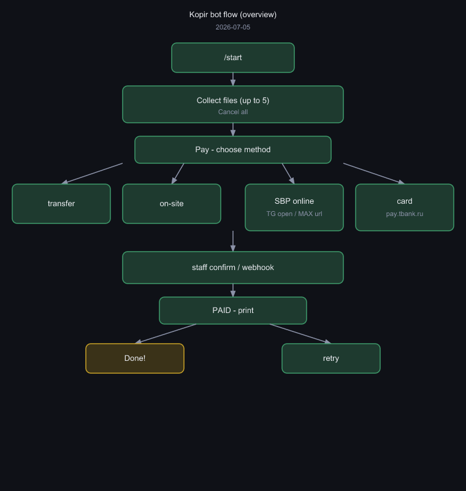
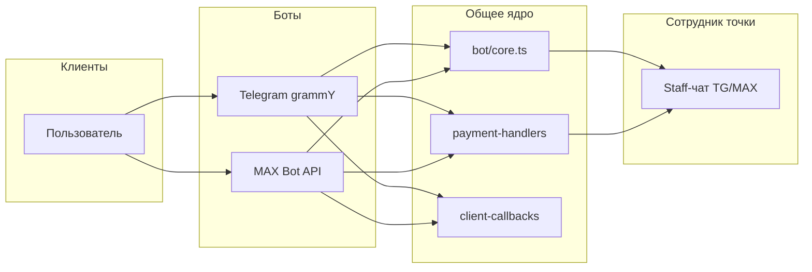
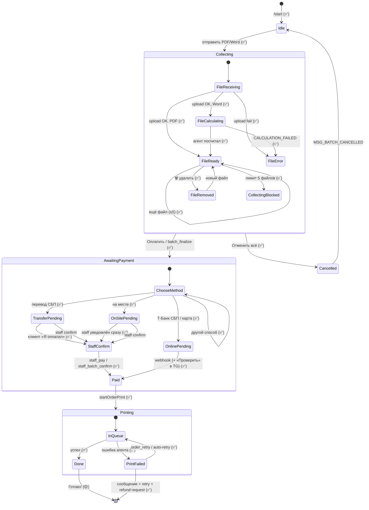
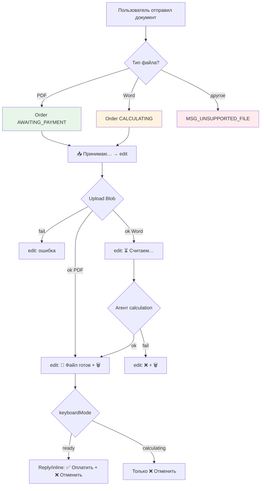
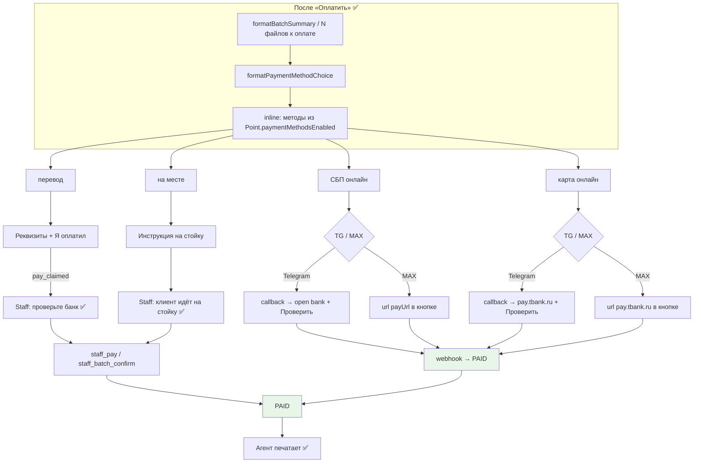
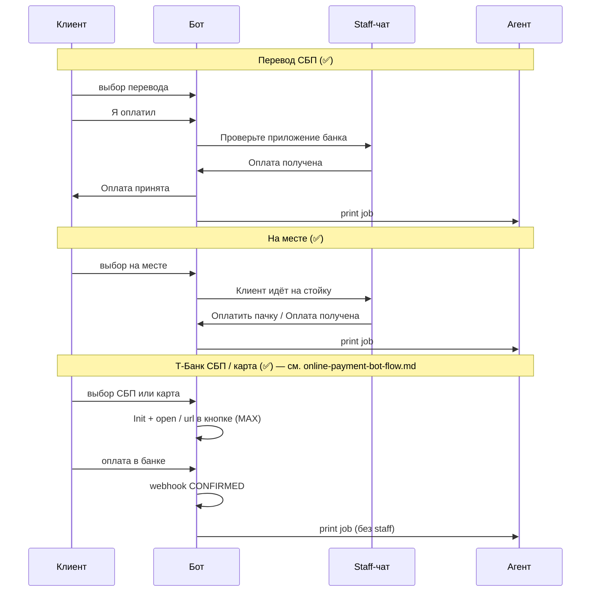

# Kopir — флоу бота: диаграмма, состояние, роадмап

> **Назначение:** единая карта взаимодействия пользователя с ботом (Telegram / MAX): команды, кнопки, условия показа, переходы.  
> **Код:** `web/server/utils/bot/`, адаптеры `telegram/`, `max/`.  
> **Обновлено:** 06.07.2026

### Визуальные схемы

| Формат | Файл | Как открыть |
|--------|------|-------------|
| **Интерактивная** (вкладки, zoom) | [bot-user-flow-diagram.html](./bot-user-flow-diagram.html) | `open doc/product/bot-user-flow-diagram.html` |
| **Картинка-обзор** | [bot-user-flow-overview.png](./bot-user-flow-overview.png) | превью; исходник [bot-user-flow-overview.svg](./bot-user-flow-overview.svg) |
| **Живой чеклист** | [bot-user-flow-status.md](./bot-user-flow-status.md) | быстрое обновление статусов |

> **Синхронизация:** при изменении UX бота обновляй весь пакет — см. `.cursor/rules/bot-ux-docs-sync.mdc`.  
> **Пересобрать PNG:** `cd doc/product && npx @resvg/resvg-js-cli bot-user-flow-overview.svg bot-user-flow-overview.png`



**Связанные документы:** [payment-flow.md](./payment-flow.md) · [online-payment-bot-flow.md](./online-payment-bot-flow.md) · [batch-edit-flow.md](./batch-edit-flow.md) · [bot-point-selection.md](./bot-point-selection.md) · [point-availability.md](./point-availability.md) · [bot-support-flow.md](./bot-support-flow.md) · [BOT_MESSENGERS.md](../project/BOT_MESSENGERS.md) · [SPRINTS.md](../sprints/SPRINTS.md) · [ROADMAP.md](../roadmap/ROADMAP.md)

---

## Легенда статусов

| Маркер | Значение |
|--------|----------|
| ✅ | Реализовано и в проде / sandbox |
| 🟡 | Частично (код есть, E2E или полировка не закрыты) |
| ⬜ | Запланировано, в коде нет |
| ⏸ | Отложено (не ближайший спринт) |
| ❌ | Отменено / заменено другим решением |

В диаграммах узлы с суффиксом `(✅)` / `(🟡)` / `(⬜)` — **текущее состояние реализации**.

---

## Текущее состояние (снимок)

> Обновляй эту таблицу при закрытии спринтов. Детальный реестр фич: [FEATURES.md](../project/FEATURES.md).

| Блок | Статус | Спринт | Примечание |
|------|--------|--------|------------|
| `/start`, deep link `point_*` | ✅ | 0 | Preference в БД (`User.preferredPointSlug`) |
| Меню команд клиента (`/print`, `/files`, `/point`, `/help`) | ✅ | 5 | TG: Menu + reply; MAX: inline |
| Выбор точки без QR (список / код) | 🟡 | 5 P0 | `point_*` callbacks; DaData/гео — позже |
| `/bind` (staff) | ✅ | 2 | Токен из админки `/admin/points` |
| Сбор нескольких файлов (batch) | ✅ | 0.2 | До 5 файлов; в UI: «Файлов: N из 5», «Отменить всё» |
| PDF + Word (.doc/.docx) | ✅ | 0.1 | Word → `CALCULATING` на агенте |
| Reply-клавиатура «Оплатить» / «Отменить всё» | ✅ | 0.2 | TG: reply; MAX: inline callback |
| Удаление файла из списка | ✅ | 1 | Inline `batch_remove:*` |
| Статусные сообщения (edit + typing) | ✅ | 1 | Один messageId на файл |
| Выбор способа оплаты | ✅ | 1 | Перевод / на месте |
| Т-Банк СБП + карта онлайн | ✅ | 3 | TG: callback + auto-open; MAX: прямые URL; см. [online-payment-bot-flow.md](./online-payment-bot-flow.md) |
| «Готово!» после печати | 🟡 | 1 | Код частично; UX-10 не закрыт |
| Блокировка offline-точки | ⬜ | 1 | MON-02 |
| Повтор печати клиентом | ✅ | 1 | `order_retry:*` при сбое |
| Запрос возврата клиентом | ✅ | 5 | `order_refund_request:*` / `batch_refund_request:*` при FAILED |
| Возврат партнёром при сбое | ✅ | 5 | `partner_refund:*` → confirm → Т-Банк Cancel |
| Staff: подтверждение оплаты | ✅ | 0–1 | `staff_pay:*`, `staff_batch_confirm:*` |
| Staff: ручная печать при сбое | ✅ | 1 | `staff_manual_print:*` |
| Mini App / корзина | ⬜ | 4 | WEB-07 |
| VK / Viber бот | ⬜ | 5 | WEB-16, WEB-17 |
| AI FAQ в боте | ⏸ | — | AI-01 |

**Активный спринт:** [Sprint 4 — ЛК партнёра в боте](../sprints/sprint-4/README.md). Эквайринг prod ✅.

---

## Роли и каналы



Один человек в TG и MAX = два `User` в БД (пилот). Staff привязывается к точке через `/bind bind_*`.

---

## Иерархия команд и действий

### Команды (текст)

| Команда | Кто | Условие | Действие | Статус |
|---------|-----|---------|----------|--------|
| `/start` | Клиент | всегда | Приветствие `MSG_START`, сохранить `point_slug` | ✅ |
| `/start point_<slug>` | Клиент | deep link / QR | Точка печати | ✅ |
| `/print` | Клиент | всегда | Инструкция `MSG_START` + меню | ✅ |
| `/files` | Клиент | всегда | Список файлов в текущей пачке | ✅ |
| `/point` | Клиент | всегда | Меню смены точки | ✅ |
| `/help` | Клиент | всегда | Справка `MSG_HELP` | ✅ |
| `/start bind_<token>` | Staff / Partner | токен из админки | Staff: `StaffChannel`; Partner: `Point.partnerId` | ✅ |
| `/start partner` | Partner | — | Меню ЛК или «не привязан» | ✅ |
| `/bind <token>` | Staff | альтернатива deep link | Привязка staff (`purpose=staff`) | ✅ |
| `/partner` | Partner | привязан к точке | Главное меню ЛК | ✅ |
| `/partner_points` | Partner | привязан к точке | Список точек / возврат в меню ЛК | ✅ |
| `/partner_balance` | Partner | привязан к точке | Баланс к выплате | ✅ |
| `/partner_requisites` | Partner | привязан к точке | Просмотр реквизитов | ✅ |
| `/partner_help` | Partner | всегда | Подсказка по командам партнёра | ✅ |
| `/partner bind_<token>` | Partner | токен из админки | Привязка `Partner` + `Point.partnerId` | ✅ |
| `/partner phone <pointId> <номер>` | Partner | владелец точки | Обновить `transferPhone` | ✅ |
| Текст `✅ Оплатить` | Клиент | TG only; есть пачка `COLLECTING`; режим `ready` | `finalizeBatch` → выбор оплаты | ✅ |
| Текст `❌ Отменить всё` | Клиент | TG; есть batch `COLLECTING` | `cancelBatch` | ✅ |

### Reply-клавиатура (Telegram)

| Кнопка | Показать когда | Скрыть когда |
|--------|----------------|--------------|
| `📄 Печать` / `📁 Мои файлы` / `📍 Точка` / `❓ Помощь` | После `/start`, отмены пачки, idle | Когда показана пачка |
| `📋 Кабинет` / `📍 Точки` / `💰 Баланс` / `🏦 Реквизиты` / `❓ Помощь` | После команд партнёра | Когда активен клиентский flow |
| `✅ Оплатить` | `getBatchKeyboardMode === 'ready'` (нет файлов в `CALCULATING`) | `calculating` или batch нет |
| `❌ Отменить всё` | Всегда, пока batch `COLLECTING` | После finalize / cancel |

MAX: команды — inline `client_cmd:*` и `partner_cmd:*`; пачка — `batch_finalize` / `batch_cancel`.

### Inline-кнопки клиента (callback)

| Payload | Экран / контекст | Условие | Статус |
|---------|------------------|---------|--------|
| `batch_finalize` | Сбор файлов | MAX; batch `COLLECTING`, mode `ready` | ✅ |
| `batch_cancel` | Сбор файлов | batch `COLLECTING` | ✅ |
| `batch_remove:{orderId}` | Сообщение файла | batch `COLLECTING`; order не `CALCULATING` | ✅ |
| `batch_remove_confirm:{orderId}` | Подтверждение удаления | После «Удалить» | ✅ |
| `batch_remove_cancel:{orderId}` | Отмена удаления | На экране confirm | ✅ |
| `point_list` | Нет точки в batch | batch `COLLECTING`, mode `needs_point` | 🟡 |
| `point_select:{slug}` | Список точек | Точка active | 🟡 |
| `point_list_page:{n}` | Пагинация списка | — | 🟡 |
| `point_change` | Точка выбрана | batch `COLLECTING` | 🟡 |
| `point_back` | Меню точки / список | — | 🟡 |
| `pay_method:sbp_transfer:{id}` | После finalize | Метод в `paymentMethodsEnabled` + есть телефон | ✅ |
| `pay_method:on_site:{id}` | После finalize | Метод включён на точке | ✅ |
| `pay_method:tbank_sbp:{id}` | После finalize | Метод + Т-Банк; TG: callback→open; MAX: url в кнопке | ✅ |
| `pay_method:tbank_card:{id}` | После finalize | То же для карты (`TBANK_ONLINE`) | ✅ |
| `pay_claimed:{id}` | Инструкция перевода | Выбран `SBP_TRANSFER` | ✅ |
| `pay_change_method:{id}` | Любой способ до confirm | `AWAITING_PAYMENT`, нет `paymentConfirmedAt` | ✅ |
| `pay_check_status:{paymentId}` | После онлайн-оплаты (TG) | polling GetState | ✅ |
| `pay_check_entity:{id}` | Экран выбора способа | если включён онлайн; polling GetState | ✅ |
| `order_retry:{orderId}` | Ошибка печати | Order в failed-состоянии | ✅ |
| `order_refund_request:{orderId}` | Ошибка печати (одиночный заказ) | Order FAILED | ✅ |
| `batch_refund_request:{batchId}` | Ошибка печати (пачка) | Есть FAILED в batch | ✅ |

`{id}` = `orderId` или `batchId`.

### Inline-кнопки staff (callback)

| Payload | Когда показывается | Статус |
|---------|-------------------|--------|
| `staff_pay:{orderId}` | Клиент: перевод + «Я оплатил» **или** on-site выбран | ✅ |
| `staff_batch_confirm:{batchId}` | То же для пачки | ✅ |
| `staff_print:{orderId}` | Legacy двухшаговый on-site (если включён) | ✅ |
| `staff_retry_print:{orderId}` | Сбой автопечати | ✅ |
| `staff_manual_print:{orderId}` | Staff распечатал вручную | ✅ |

Staff callback маршрутизируется только если payload **не** клиентский и **не** `partner_*` (`staff-auth.ts`).

### Inline-кнопки partner (callback)

| Payload | Экран | Статус |
|---------|-------|--------|
| `partner_menu` | Главное меню / список точек | ✅ |
| `partner_point:{pointId}` | Подменю точки | ✅ |
| `partner_status:{pointId}` | Агент online/offline | ✅ |
| `partner_orders:{pointId}:{day\|week\|month}` | Статистика заказов | ✅ |
| `partner_settings:{pointId}` | Цена, способы оплаты, телефон | ✅ |
| `partner_price:{pointId}:{kopeks}` | Пресет цены | ✅ |
| `partner_price_adj:{pointId}:{delta}` | ±1 ₽ | ✅ |
| `partner_toggle_pay:{pointId}:{method}` | Вкл/выкл способ оплаты | ✅ |
| `partner_phone_hint:{pointId}` | Подсказка `/partner phone …` | ✅ |
| `partner_balance` | Баланс + последние 10 операций | ✅ |
| `partner_refund:{orderId}` | Уведомление о сбое печати | FAILED + онлайн-оплата | ✅ |
| `partner_refund_confirm:{orderId}` | Подтверждение возврата | После `partner_refund` | ✅ |
| `partner_refund_cancel:{orderId}` | Отмена возврата | После `partner_refund` | ✅ |

Начисление на баланс: только `TBANK_SBP` / `TBANK_ONLINE`, default split **75/25** (`commissionPercent=25`; early bird ≤10 точек — **14%**; пилоты могут иметь 30%), идемпотентно по `batchId`. Tiered — Sprint 6.

---

## Главная диаграмма: клиентский флоу



### Условия переходов (кратко)

| Из | В | Условие |
|----|---|---------|
| `Idle` | `Collecting` | Документ PDF/Word; точка резолвится по `point_slug` |
| `Collecting` | `Collecting` | `activeCount < BATCH_MAX_FILES` (default 5) |
| `Collecting` | `AwaitingPayment` | Все order ≠ `CALCULATING`; `finalizeBatch` OK |
| `Collecting` | `Cancelled` | `batch_cancel` или таймаут `BATCH_BUILD_TIMEOUT_MIN` (15 мин) |
| `AwaitingPayment` | `Paid` | `paymentConfirmedAt` (staff или webhook Т-Банка) |
| `Paid` | `Printing` | Агент online **или** заказ в очереди (offline → 🟡 предупреждение) |
| `Printing` | `Done` | Агент: `COMPLETED` / уведомление клиенту |

---

## Диаграмма: сбор файла (детально)



**Показать `🗑 Удалить`:** order в пачке `COLLECTING`, статус не `CALCULATING`.  
**Скрыть `✅ Оплатить`:** хотя бы один файл в `CALCULATING`.

---

## Диаграмма: оплата

> **Детально (онлайн TG vs MAX):** [online-payment-bot-flow.md](./online-payment-bot-flow.md)



Фильтрация методов (`payment-config.ts`):

- `SBP_TRANSFER` — только если задан `transferPhone` (точка или env)
- `TBANK_SBP`, `TBANK_ONLINE` — только если настроен Т-Банк (`isTbankConfigured()`)
- `ON_SITE` — всегда, если включён в списке

---

## Диаграмма: staff (параллельный флоу)



Fallback staff-канала: env `STAFF_TELEGRAM_CHAT_ID` / `STAFF_MAX_USER_ID`, если нет `StaffChannel` в БД.

---

## Статусы в БД (для привязки к UI)

### OrderBatch

| Статус | Что видит клиент | Доступные действия |
|--------|------------------|-------------------|
| `COLLECTING` | Слоты файлов, reply/inline управление | Файлы, удалить, оплатить, отменить |
| `AWAITING_PAYMENT` | Сводка + выбор оплаты | Методы оплаты, смена способа |
| `PAID` | «Оплата принята» | — (ждёт печать) |
| `CANCELLED` | «Пачка отменена» | `/start`, новый файл |

### Order (внутри пачки)

| Статус | UI |
|--------|-----|
| `AWAITING_PAYMENT` | PDF готов, цена посчитана |
| `CALCULATING` | «Считаем страницы…», без 🗑 |
| `CALCULATION_FAILED` | Ошибка + 🗑 |
| `PAID` / `PRINTING` / `COMPLETED` / `FAILED` | После оплаты; retry при FAILED |

---

## Роадмап UX бота

Синхронизировано с [ROADMAP.md](../roadmap/ROADMAP.md) и [SPRINTS.md](../sprints/SPRINTS.md).

### Ближайшие спринты

| Спринт | UX в боте / админке | Статус |
|--------|-----------|--------|
| **3** Т-Банк | СБП/карта, webhook → автопечать | ✅ prod |
| **3** | Облачная касса — чек в мессенджер | ⏸ PAY-04 |
| **4** ЛК партнёра | Partner bind, баланс, настройки точки | ⬜ |
| **4** | «Ссылка точки»: QR + deep links TG/MAX в админке | ⬜ [06](../sprints/sprint-4/tasks/06-point-client-links.md) |
| **4** | «Готово!», блок offline-точки | ⬜ UX-10, MON-02 |
| **5** | Выбор точки в боте без QR (список, код, last point) | ⬜ UX-06 |
| **5** | Карта точек, Mini App | ⬜ WEB-10 |
| **5** | «Проблема с печатью», VK, `/go?point=` | ⬜ UX-11, WEB-09 |

### Средний горизонт (после MVP)

| Фича | Описание | Feature |
|------|----------|---------|
| Калькулятор в реальном времени | Ч/Б, дуплекс до оплаты | UX-01–03 |
| Количество копий (1–10) | Inline `−` / `+` на файле до оплаты | UX-04 ✅ Sprint 5 |
| Выбор точки | Геолокация, ручной номер | UX-06, UX-07 |
| Статус печати live | «3 из 15 стр.» | UX-09 |
| Таймаут неоплаченных | Напоминание + автоотмена 30 мин | payment-flow фаза 2 |
| Блок offline-точки | Не принимать заказ, если агент offline | MON-02 |
| AI FAQ | Groq в боте | ⏸ AI-01 |

### Отменено / backlog

| Было | Решение |
|------|---------|
| WebSocket в Sprint 1 | ❌ → polling + `lastSeenAt` (достаточно для 1–3 точек) |
| Демо-оплата без денег | ❌ cancelled — есть ручная оплата |
| Команды `/udalit N` | ⏸ — inline 🗑 достаточно для MVP |
| «Моя пачка» (сводка) | ⏸ — лента сообщений + Mini App позже |

---

## Календарь (июль – сентябрь 2026)

| Период | Фокус бота |
|--------|------------|
| **Июль, нед. 1–2** | Sprint 4: partner-бот ЛК, баланс, лендинг `/partners` |
| **Июль, нед. 3–4** | Sprint 5 старт: реестр выплат PAY-07 |
| **Август** | Sprint 5: 5+ точек, VK deep link, алерты |
| **До 1 сент.** | Стабильность, super-admin GMV |
| **Сентябрь+** | Рост, принт-бокс сценарии |

---

## Как обновлять этот документ

1. **Снимок «Текущее состояние»** — при merge фичи или закрытии спринта.
2. **Маркеры на диаграммах** — менять `(✅)` → `(🟡)` → `(⬜)` у соответствующих узлов.
3. **Новый callback** — добавить строку в таблицу «Inline-кнопки» + ветку в mermaid.
4. **Реестр фич** — дублировать статус в [FEATURES.md](../project/FEATURES.md) (источник правды по ID).

### Чеклист при изменении `bot/core.ts` или `keyboards.ts`

- [ ] Таблица команд / callbacks
- [ ] Условия reply-клавиатуры
- [ ] Диаграмма оплаты (если новый `pay_*`)
- [ ] Снимок статуса вверху файла
- [ ] [payment-flow.md](./payment-flow.md) — если меняется бизнес-логика оплаты

---

## Файлы в репозитории

```
web/server/utils/bot/
  core.ts              # handleStart, handleDocument, batch, remove
  payment-handlers.ts  # выбор оплаты, Т-Банк UI
  client-callbacks.ts  # маршрутизация inline
  keyboards.ts         # payload-ы кнопок
  messages.ts          # тексты RU
web/server/utils/telegram/bot.ts
web/server/utils/max/handler.ts
web/server/utils/staff-actions.ts
web/server/utils/staff-notify.ts
```
