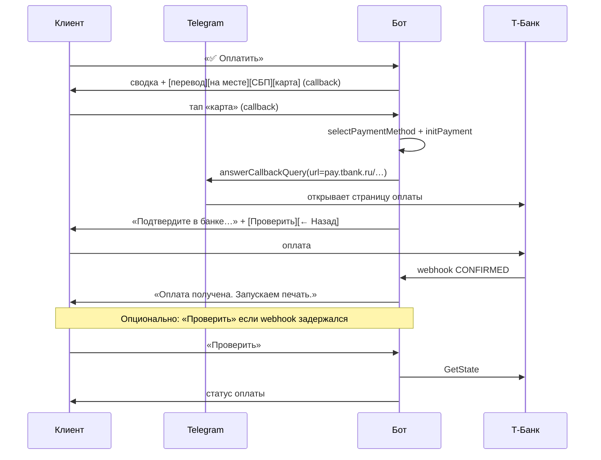
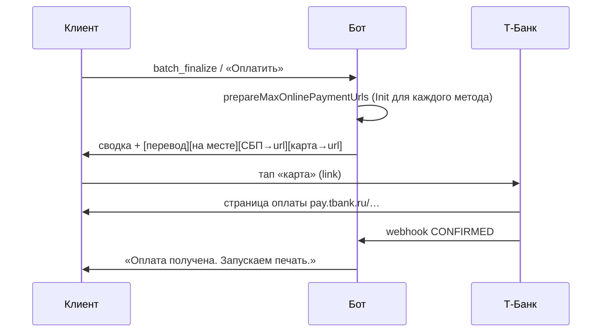
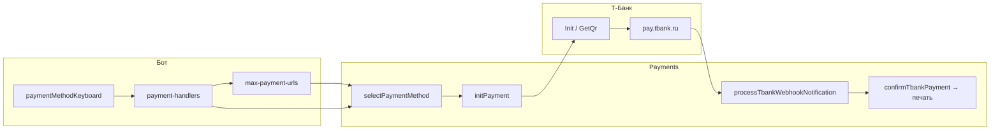
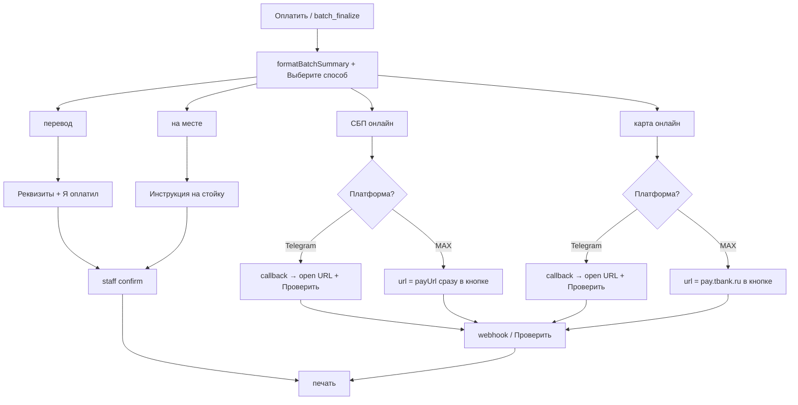

# Онлайн-оплата в боте (Telegram / MAX)

> **Статус:** реализовано (Sprint 3)  
> **Код:** `web/server/utils/bot/payment-handlers.ts`, `keyboards.ts`, `messages.ts`, `payments/max-payment-urls.ts`, `payments/providers/tbank-acquiring.ts`  
> **Связано:** [payment-flow.md](./payment-flow.md) (ручные способы), [bot-user-flow.md](./bot-user-flow.md) (общая карта бота)  
> **Обновлено:** 05.07.2026

Документ описывает **актуальный UX и технику** онлайн-оплаты через Т-Банк (СБП и карта) в клиентском боте. Ручные способы («перевод», «на месте») — в [payment-flow.md](./payment-flow.md).

---

## Кратко

| Платформа | Кнопки «СБП» / «карта» на экране выбора | Открытие оплаты | После оплаты |
|-----------|----------------------------------------|----------------|--------------|
| **Telegram** | callback (не URL) | сразу при тапе (`answerCallbackQuery` + `url`) | сообщение + «Проверить» / «← Назад»; webhook тоже подтверждает |
| **MAX** | прямые ссылки на Т-Банк (`pay.tbank.ru/…`) | при тапе по ссылке | webhook; «Проверить» на экране выбора способа |

Оба мессенджера используют один backend: `initPayment` → Т-Банк Init/GetQr → webhook `POST /api/payments/webhook/tbank` → печать.

---

## Общий путь до оплаты

Одинаков для Telegram и MAX:

```
Файлы (до 5 за раз) → подсчёт → «✅ Оплатить»
  → сводка (N файлов к оплате, сумма)
  → «Выберите способ:»
  → inline-кнопки методов
```

### Тексты для клиента (без слова «пачка»)

| Было | Стало |
|------|-------|
| «В пачке: 2 из 5» | «Файлов: 2 из 5» |
| «Отменить пачку» | «❌ Отменить всё» |
| «Пачка собрана» | «N файлов к оплате» |
| `/start`: «в одну пачку» | «до 5 документов за раз — оплата одна» |

Staff-уведомления и админка по-прежнему могут использовать термин «пачка».

### Кнопки на экране выбора способа

Зависят от `Point.paymentMethodsEnabled` и конфига (`payment-config.ts`, `tbank-config.ts`):

| Кнопка | Callback / URL | Метод в БД |
|--------|----------------|------------|
| `перевод` | `pay_method:sbp_transfer:{id}` | `SBP_TRANSFER` |
| `на месте` | `pay_method:on_site:{id}` | `ON_SITE` |
| `СБП` | см. ниже (TG vs MAX) | `TBANK_SBP` |
| `карта` | см. ниже (TG vs MAX) | `TBANK_ONLINE` |
| `Проверить` | `pay_check_entity:{id}` | только если включён онлайн; GetState по pending-платежам |

Если онлайн-методы включены, после «Выберите способ:» — подсказка: *«После оплаты придёт подтверждение. Не дождались — «Проверить».»*

---

## Telegram: онлайн СБП и карта

### UX (один тап до банка)



### Шаги

1. **Экран выбора** — кнопки «СБП» и «карта» это **inline callback**, не ссылки.
2. **Тап по СБП/карта** — сервер:
   - `selectPaymentMethod`
   - `initPayment` (канал `sbp` или `card`)
   - `answerCallbackQuery` с `url` = прямой `payUrl` Т-Банка
   - новое сообщение с текстом «Подтвердите оплату в банке…» и кнопками **«Проверить»** / **«← Назад»**
3. **Подтверждение** — в первую очередь **webhook** Т-Банка; кнопка «Проверить» (`pay_check_status:{paymentId}`) — запасной polling через `GetState`.

### Почему не прямые URL в кнопках на первом экране

В Telegram можно вставить `url` в inline-кнопку, но тогда **не вызывается callback** — нельзя одновременно выбрать способ в БД и открыть оплату без pre-init. Текущая схема: **один тап** через `answerCallbackQuery.url` — UX эквивалентен прямой ссылке.

---

## MAX: онлайн СБП и карта

### UX (ссылки сразу на экране выбора)



### Шаги

1. **При показе экрана оплаты** (`sendPaymentMethodChoiceForBatch` / `…ForOrder`) для MAX вызывается `prepareMaxOnlinePaymentUrls`:
   - для каждого включённого онлайн-метода: `selectPaymentMethod` + `initPayment`
   - в кнопки подставляется **прямой** `payUrl` Т-Банка (`https://pay.tbank.ru/…` для карты, payload GetQr для СБП)
2. **Тап по «СБП» или «карта»** — открывается банк, **без** второго сообщения и без «Открыть оплату» / «Проверить».
3. **Подтверждение** — только webhook (и внутренний reconcile при необходимости).

### Два онлайн-метода одновременно

Если на точке включены и СБП, и карта:

- создаются **два** pending-платежа (`initPayment` с `preservePending: true` для второго);
- `merchantOrderId` с префиксом `kps_` (СБП) или `kpc_` (карта);
- при webhook способ на заказе/батче синхронизируется по префиксу (`syncPaymentMethodOnEntity`);
- остальные pending по той же сущности отменяются.

### Устаревшие callback на MAX

Если пользователь тапает старую callback-кнопку «СБП»/«карта» (до обновления), бот отвечает тостом: *«Нажмите «СБП» или «карта» в сообщении выше»*.

---

## Ручные способы (без изменений)

### Перевод (`SBP_TRANSFER`)

```
💳 сумма · #shortId
Реквизиты + комментарий
[Я оплатил] [← Назад]
```

Staff уведомляется **после** «Я оплатил».

### На месте (`ON_SITE`)

```
💳 сумма · #shortId
Оплатите у сотрудника на стойке
[← Назад]
```

Staff уведомляется при выборе способа.

---

## Сравнение платформ (онлайн)

| | Telegram | MAX |
|---|----------|-----|
| Тип кнопок СБП/карта на 1-м экране | `callback_data` | `url` (Т-Банк) |
| Когда вызывается Init | при тапе по методу | при показе экрана оплаты |
| Промежуточное сообщение | да («Подтвердите в банке…») | нет |
| «Проверить» на экране выбора | да | да |
| «Проверить» после онлайн-выбора (TG) | да | нет |
| «← Назад» после онлайн-выбора | да | нет (смена способа — с экрана выбора до оплаты) |
| Pre-init обоих каналов | нет | да |

---

## Техническая схема



### Ключевые файлы

| Файл | Роль |
|------|------|
| `bot/messages.ts` | тексты, `BTN_CANCEL_BATCH` = «Отменить всё» |
| `bot/keyboards.ts` | `paymentMethodKeyboard`, `onlinePaymentCheckKeyboard` |
| `bot/payment-handlers.ts` | выбор способа, TG `sendTbankPaymentUi`, MAX keyboard |
| `payments/max-payment-urls.ts` | `prepareMaxOnlinePaymentUrls` |
| `payments/providers/tbank-acquiring.ts` | Init, webhook, `kps_`/`kpc_` order id |
| `payments/service.ts` | `selectPaymentMethod`, `syncPaymentMethodOnEntity` |
| `api/payments/webhook/tbank.post.ts` | HTTP webhook |

### Callback payload (клиент)

| Payload | Действие |
|---------|----------|
| `pay_method:{method}:{entityId}` | выбор способа (TG онлайн; ручные везде) |
| `pay_check_status:{paymentId}` | После онлайн-оплаты (TG) | polling GetState по paymentId | ✅ |
| `pay_check_entity:{id}` | Экран выбора способа | если включён онлайн; ищет pending/confirmed по entity | ✅ |
| `pay_change_method:{entityId}` | вернуться к выбору способа |
| `pay_claimed:{entityId}` | «Я оплатил» (перевод) |

### Env

```env
PAYMENT_METHODS_ENABLED=SBP_TRANSFER,TBANK_SBP,TBANK_ONLINE,ON_SITE
TBANK_TERMINAL_KEY=...
TBANK_PASSWORD=...
NUXT_PUBLIC_SITE_URL=https://...   # webhook URL; для MAX прямых ссылок не нужен
TBANK_NOTIFICATION_URL=...         # опционально, иначе строится из SITE_URL
```

---

## Диаграмма: все способы после «Оплатить»



---

## Ограничения и краевые случаи

1. **Срок ссылки (MAX)** — URL создаются при показе экрана оплаты. Если пользователь долго не платит, ссылка может устареть → «← Назад» (где есть) / заново «Оплатить».
2. **Один оплаченный из двух pending** — второй pending отменяется при подтверждении первого.
3. **Legacy `kp_` merchantOrderId** — канал определяется по URL в `qrPayload` (`pay.tbank.ru` → карта).
4. **E2E sandbox** — см. [sprint-3](../sprints/sprint-3/README.md); документ описывает целевой prod-like UX.

---

## История изменений

| Дата | Изменение |
|------|-----------|
| 05.07.2026 | Прямые URL Т-Банка в MAX; TG — один тап через `answerCallbackQuery.url`; убраны «пачка» в клиентских текстах; убран redirect `/api/payments/open` |
