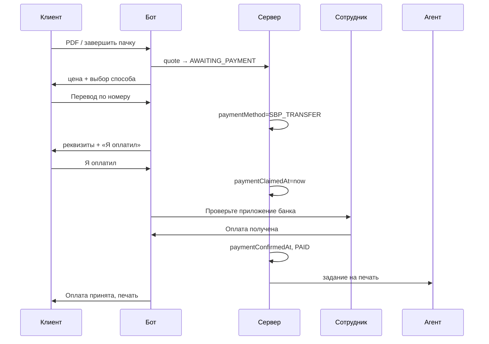

# Оплата в боте: перевод и «на месте»

> **Статус:** реализовано (Sprint 1), эквайринг — Sprint 2  
> **Feature IDs:** PAY-01 (расширение), PAY-02/03 (эквайринг), UX-12  
> **Связано:** [FEATURES.md](../project/FEATURES.md), [BOT_MESSENGERS.md](../project/BOT_MESSENGERS.md), [sprint-1/tasks/13-payment-method-choice.md](../sprints/sprint-1/tasks/13-payment-method-choice.md)

## Цель

Клиент после расчёта цены **сам выбирает способ оплаты**:

| Способ | Когда | Кто подтверждает |
|--------|-------|------------------|
| **Перевод по номеру (СБП)** | Клиент переводит на счёт копицентра | Сотрудник проверяет приложение банка |
| **На месте** | Клиент платит на стойке (терминал / наличные) | Сотрудник принимает оплату и подтверждает в боте |

**Печать не начинается**, пока оплата не подтверждена (`paymentConfirmedAt` → `PAID`).

Позже тот же каркас подключает **Т-Банк / ЮKassa** без переписывания бота и статусов заказа.

---

## Текущее состояние (что уже есть)

| Компонент | Статус |
|-----------|--------|
| `Order.status = AWAITING_PAYMENT` → `PAID` | ✅ |
| `Order.paymentConfirmedAt` — метка подтверждения оплаты | ✅ |
| `PAYMENT_MODE=terminal` — ручное подтверждение | ✅ |
| Staff-уведомления (`notifyStaffOrderAwaitingPayment`) | ✅ |
| Кнопки staff: «Оплата получена» / «Печать» | ✅ |
| `startOrderPrint` блокируется без `paymentConfirmedAt` | ✅ |
| Пачки (`OrderBatch`) + одно подтверждение на пачку | ✅ |
| Выбор способа оплаты клиентом | ✅ |
| Реквизиты перевода на уровне точки | ✅ |
| Разные тексты staff в зависимости от способа | ✅ |
| Абстракция `PaymentProvider` | ✅ (скелет) |
| Т-Банк / ЮKassa webhook | ❌ (Sprint 2) |

Сейчас бот сразу пишет «Оплатите на терминале» (`clientPaymentHint()`), без выбора. Staff получает уведомление **сразу после quote**, ещё до выбора способа клиентом.

---

## UX: клиент

### Общий поток (одиночный заказ и пачка)

```
Файл(ы) → подсчёт → цена (AWAITING_PAYMENT)
        → выбор способа оплаты          ← новый шаг
        → инструкция по выбранному способу
        → «Я оплатил» (только для перевода)
        → ожидание подтверждения сотрудником
        → «Оплата принята!» → печать
```

### Шаг 1 — выбор способа

После `formatQuote` / `formatBatchSummary` бот показывает **inline-клавиатуру**:

```
📱 Перевод по номеру
💳 Оплата на месте
```

Callback: `pay_method:sbp_transfer:<orderOrBatchId>` / `pay_method:on_site:<orderOrBatchId>`

До выбора способа staff **не** получает никаких уведомлений.

**Принято:** для перевода staff уведомляется **только после** нажатия клиентом «Я оплатил» — не при выборе способа.

### Шаг 2а — перевод по номеру

```
💳 К оплате: 150 ₽
Заказ #abc123

Переведите через СБП на номер:
+7 900 123-45-67
(Сбербанк, ИП Иванов)

⚠️ В комментарии к переводу укажите: abc123

После перевода нажмите «Я оплатил».
```

Кнопки:
- `pay_claimed:<id>` — «✅ Я оплатил»
- `pay_change_method:<id>` — «← Другой способ» (вернуться к выбору, пока не подтверждено)

### Шаг 2б — оплата на месте

```
💳 К оплате: 150 ₽
Заказ #abc123

Подойдите к стойке копицентра и оплатите у сотрудника.
Назовите номер заказа: abc123
```

Кнопка: `pay_change_method:<id>` — сменить способ.

### Шаг 3 — ожидание

```
⏳ Ждём подтверждения оплаты.
Обычно это занимает 1–2 минуты.
```

Печать **не** стартует. Клиент может написать в поддержку / к сотруднику.

### Таймаут (опционально, фаза 2)

Если `AWAITING_PAYMENT` + выбран способ > 30 мин без подтверждения — напоминание клиенту и автоотмена пачки (использовать `BATCH_BUILD_TIMEOUT_MIN` как основу).

---

## UX: сотрудник

### Перевод по номеру

**Триггер уведомления:** клиент нажал «Я оплатил» (`paymentClaimedAt`). До этого staff о переводе не знает.

```
🔔 Проверьте приложение банка

Заказ #abc123 | 150 ₽
📄 report.pdf | 12 стр.
Клиент: @ivan
Способ: перевод СБП

Ожидаем поступление на +7 900 ***-**-67
Комментарий к переводу: abc123

[✅ Оплата получена]
```

После «Оплата получена»:
1. `paymentConfirmedAt = now()`
2. `startOrderPrint` → `PAID` → агент печатает
3. Staff: «✅ Оплата по #abc123 принята. Печать запущена.»

### Оплата на месте

**Триггер:** клиент выбрал «На месте».

```
🆕 Клиент идёт на стойку

Заказ #abc123 | 150 ₽
📄 report.pdf | 12 стр.
Клиент: @ivan
Способ: оплата на месте

Примите оплату на терминале / в кассе, затем:
[✅ Оплата получена]
```

Двухшаговая схема «Оплата получена → Печать» **сохраняется** для on-site (сотрудник может сначала принять деньги, потом нажать печать). Для перевода — одна кнопка «Оплата получена» сразу запускает печать (как сейчас в `confirmOrderPayment`).

### Пачка

Аналогично, но:
- выбор способа один раз на `OrderBatch`
- staff callback `staff_batch_confirm:<batchId>`
- в тексте — список файлов и итоговая сумма

---

## Статусная модель

### Заказ / пачка

Существующие статусы **не меняем**. Добавляем поля выбора способа:

```
AWAITING_PAYMENT
  ├── paymentMethod: null          → клиент ещё не выбрал
  ├── paymentMethod: SBP_TRANSFER  → ждём перевод / подтверждение staff
  └── paymentMethod: ON_SITE       → ждём оплату на стойке

paymentConfirmedAt set + PAID      → печать
```

### Инварианты

| Правило | Где проверять |
|---------|---------------|
| Печать только после `paymentConfirmedAt` | `startOrderPrint`, `confirmBatchPayment` |
| Смена способа только в `AWAITING_PAYMENT` без `paymentConfirmedAt` | `handlePaymentMethodChoice` |
| Staff callback только для своей точки (Sprint 2+) | `staff-actions` + `PointStaffBinding` |
| Idempotent: повторное «Оплата получена» | уже есть в `confirmOrderPayment` |

---

## Архитектура: слой платежей

Чтобы не переписывать бот при подключении эквайринга, вводим **тонкий слой** `server/utils/payments/`:

```
payments/
  types.ts              # PaymentMethod, PaymentProviderId, PaymentInitResult
  registry.ts           # getProviderForMethod(method, point)
  providers/
    manual-transfer.ts  # СБП на телефон точки, staff confirm
    manual-on-site.ts   # терминал / касса, staff confirm
    tbank-acquiring.ts  # Sprint 2: Init + GetQr + webhook
    yookassa.ts         # будущее: альтернатива Т-Банку
  service.ts            # initiatePayment, confirmPayment, onWebhook
```

### Контракт `PaymentProvider`

```typescript
interface PaymentProvider {
  readonly id: PaymentProviderId
  readonly methods: PaymentMethod[]

  /** После выбора клиентом — тексты и кнопки в боте */
  getClientInstructions(ctx: PaymentContext): ClientPaymentUi

  /** Когда уведомить staff: перевод — on_client_claimed, на месте — on_method_selected */
  readonly staffNotifyTrigger: 'on_method_selected' | 'on_client_claimed'
  // manual-transfer: on_client_claimed (зафиксировано)
  // manual-on-site: on_method_selected

  /** Staff / webhook подтверждает оплату → PAID + печать */
  confirm(ctx: PaymentContext): Promise<ConfirmResult>

  /** Только для эквайринга */
  initiateOnline?(ctx: PaymentContext): Promise<{ paymentUrl?: string; qrPayload?: string }>
  handleWebhook?(payload: unknown): Promise<ConfirmResult | null>
}
```

### Эволюция по этапам

| Этап | Провайдеры | Деньги куда | Подтверждение |
|------|------------|-------------|---------------|
| **Пилот (Sprint 1)** | `manual-transfer`, `manual-on-site` | Прямо на счёт копицентра | Staff в TG/MAX |
| **Sprint 2** | + `tbank-acquiring` | Сплит / агентская схема | Webhook Т-Банка |
| **Sprint 3+** | + `yookassa` (опция) | ЮKassa split | Webhook |
| **Боксы** | + `pos-terminal` (Vendotek) | POS на устройстве | Агент |

`PAYMENT_MODE=terminal` остаётся флагом «нет автоматического эквайринга».  
`PAYMENT_MODE=online` включает провайдеры с webhook; ручные методы можно оставить как fallback для копицентров без эквайринга.

### Выбор провайдера на точке

```prisma
model Point {
  // ...
  transferPhone       String?   // СБП-номер для переводов
  transferBankLabel   String?   // «Сбербанк, ИП Иванов»
  paymentMethodsEnabled String[] // ["SBP_TRANSFER", "ON_SITE", "ONLINE_SBP"]
}
```

На пилоте реквизиты можно задать через env (`POINT_TRANSFER_PHONE`) с fallback на поля `Point` после Sprint 3 (онбординг партнёра).

---

## Схема данных (Prisma)

### Новые enum

```prisma
enum PaymentMethod {
  SBP_TRANSFER   // перевод на телефон / счёт точки
  ON_SITE        // терминал / касса
  ONLINE_SBP     // СБП через эквайринг (Т-Банк, ЮKassa) — Sprint 2+
}

enum PaymentProviderId {
  MANUAL
  TBANK
  YOOKASSA
}
```

### Поля на `Order` и `OrderBatch`

```prisma
model Order {
  // ...
  paymentMethod       PaymentMethod?
  paymentMethodAt     DateTime?        // когда клиент выбрал
  paymentClaimedAt    DateTime?        // «Я оплатил»
  paymentProviderId   PaymentProviderId?
}

model OrderBatch {
  // ...
  paymentMethod       PaymentMethod?
  paymentMethodAt     DateTime?
  paymentClaimedAt    DateTime?
  paymentProviderId   PaymentProviderId?
}
```

### Будущая таблица `Payment` (Sprint 2, не блокирует пилот)

```prisma
model Payment {
  id              String   @id @default(cuid())
  orderId         String?
  batchId         String?
  providerId      PaymentProviderId
  externalId      String?          // paymentId Т-Банка / ЮKassa
  amountKopeks    Int
  status          String           // pending | succeeded | failed | refunded
  metadata        Json?
  createdAt       DateTime @default(now())
  confirmedAt     DateTime?
}
```

Один `Payment` на заказ/пачку; webhook обновляет `Payment.status` и вызывает общий `confirmPayment()`.

---

## Изменения в коде

### Бот (`server/utils/bot/`)

| Файл | Изменение |
|------|-----------|
| `core.ts` | `handlePaymentMethodChoice`, `handlePaymentClaimed`; не вызывать `notifyStaffAfterOrderReady` до выбора способа |
| `messages.ts` | тексты перевода, on-site, ожидание; убрать жёсткий `clientPaymentHint()` |
| `telegram/bot.ts`, `max/handler.ts` | callback `pay_method:*`, `pay_claimed:*`, `pay_change_method:*` |

### Staff

| Файл | Изменение |
|------|-----------|
| `staff-notify.ts` | `formatStaffTransferAwaitingConfirm`, `formatStaffOnSiteAwaitingPayment`; разные клавиатуры |
| `order-staff-actions.ts` | без изменений логики gate; опционально auto-print только для `SBP_TRANSFER` |
| `batch.ts` | `confirmBatchPayment` учитывает `paymentMethod` |

### API

| Endpoint | Назначение |
|----------|------------|
| `POST /api/admin/orders/:id/confirm-payment` | уже есть |
| `POST /api/payments/webhook/tbank` | Sprint 2 |
| `POST /api/payments/webhook/yookassa` | будущее |

---

## Диаграмма: перевод СБП (пилот)



---

## Диаграмма: эквайринг (Sprint 2+)

Тот же UX в Mini App / боте, но вместо staff confirm:

```
Клиент → «Оплатить СБП» → PaymentProvider.initiateOnline()
       → QR / deep link Т-Банка
       → webhook succeeded → confirmPayment() → PAID → печать
```

Ручные методы (`SBP_TRANSFER`, `ON_SITE`) остаются в `paymentMethodsEnabled` для точек без договора эквайринга.

---

## План работ

### Фаза 0 — Документ и согласование (сейчас)

- [x] Спека UX и архитектуры — этот файл
- [x] Staff «проверьте банк» — **только после «Я оплатил»** (не при выборе перевода)
- [ ] Согласовать с копицентром: номер для СБП, тексты на стойке

### Фаза 1 — Пилот в боте (Sprint 1, ~2–3 дня)

📁 [sprint-1/tasks/13-payment-method-choice.md](../sprints/sprint-1/tasks/13-payment-method-choice.md)

| # | Задача | Оценка |
|---|--------|--------|
| 1.1 | Prisma: `PaymentMethod`, поля на Order/Batch, миграция | 1 ч |
| 1.2 | `Point.transferPhone` + env fallback | 30 мин |
| 1.3 | `payments/types.ts`, `manual-transfer.ts`, `manual-on-site.ts` | 2 ч |
| 1.4 | Бот: клавиатура выбора + callbacks | 2 ч |
| 1.5 | Бот: тексты реквизитов, «Я оплатил», смена способа | 1 ч |
| 1.6 | Staff: разные уведомления по `paymentMethod` | 1.5 ч |
| 1.7 | Staff: перевод — после `pay_claimed`; on-site — при выборе способа | 30 мин |
| 1.8 | E2E: перевод + on-site, одиночный заказ и пачка | 2 ч |

**Не в фазе 1:** демо-оплата (`DEMO_PAYMENT_ENABLED`) — отдельный shortcut для тестов без денег; не смешивать с production flow.

### Фаза 2 — Полировка пилота (Sprint 1–2)

| # | Задача | Спринт |
|---|--------|--------|
| 2.1 | Таймаут неоплаченных заказов + напоминание клиенту | 1 |
| 2.2 | `/bind` — staff привязан к `pointId`, видит только свои заказы | 2 |
| 2.3 | Partner dashboard: список ожидающих оплат | 3 |
| 2.4 | Уникальный комментарий к переводу (защита от коллизий shortId) | 2 |

### Фаза 3 — Эквайринг (Sprint 2)

| # | Задача | Feature |
|---|--------|---------|
| 3.1 | Таблица `Payment` | PAY-02 |
| 3.2 | `tbank-acquiring` provider: Init, GetQr | PAY-02 |
| 3.3 | Webhook → `confirmPayment` → печать | PAY-03 |
| 3.4 | Mini App: тот же `PaymentProvider` API | WEB-07 |
| 3.5 | Один платёж на `OrderBatch` | PAY-02 |
| 3.6 | Облачная касса | PAY-04 |

### Фаза 4 — Масштабирование (Sprint 3+)

| # | Задача |
|---|--------|
| 4.1 | Реквизиты и `paymentMethodsEnabled` в онбординге партнёра |
| 4.2 | ЮKassa как альтернативный `PaymentProvider` |
| 4.3 | Revenue share / сплит (агентская схема) |
| 4.4 | Автовыплаты партнёрам (Mass Payments) |
| 4.5 | Возврат при ошибке печати (PAY-11) |

---

## Переменные окружения (пилот)

```env
# web/.env
PAYMENT_MODE=terminal
POINT_TRANSFER_PHONE="+79001234567"
POINT_TRANSFER_BANK_LABEL="Сбербанк, ИП Иванов"
PAYMENT_METHODS_ENABLED="SBP_TRANSFER,ON_SITE"   # через запятую
# Staff «проверьте банк» — только после pay_claimed (зашито в manual-transfer provider)
```

---

## Принятые решения

| Решение | Значение |
|---------|----------|
| Staff «проверьте банк» (перевод) | Только после «Я оплатил» |
| Staff для «На месте» | При выборе способа («Клиент идёт на стойку») |
| Кнопка «Я оплатил» для on-site | Нет |

## Открытые вопросы

| # | Вопрос | Рекомендация |
|---|--------|--------------|
| 1 | ~~Когда слать staff «проверьте банк»?~~ | ✅ После «Я оплатил» |
| 2 | ~~Нужна ли кнопка «Я оплатил» для on-site?~~ | ✅ Нет — staff при выборе «На месте» |
| 3 | Демо-оплата vs реальный перевод в Sprint 1 beta | Демо для UX-тестов; реальный flow — перед открытием стойки |
| 4 | Комментарий к переводу: shortId (6 символов) достаточно? | Да на пилоте; позже `KOP-abc123` или полный cuid |
| 5 | ЮKassa vs Т-Банк приоритет | Т-Банк в PROJECT.md; ЮKassa — второй провайдер через тот же интерфейс |
| 6 | Печать сразу после staff confirm для перевода или две кнопки? | Одна кнопка «Оплата получена» → сразу печать |

---

## Критерии приёмки (пилот)

- [ ] Клиент видит выбор способа после quote / summary пачки
- [ ] При переводе показаны реквизиты точки и сумма
- [ ] Печать не стартует до staff confirm / webhook
- [ ] Staff получает «Проверьте приложение банка» только для перевода
- [ ] On-site: staff знает, что клиент идёт на стойку
- [ ] Пачка: один способ оплаты на всю пачку
- [ ] Смена способа до подтверждения оплаты работает
- [ ] Повторное подтверждение — идемпотентно
- [ ] Архитектура `PaymentProvider` задокументирована и готова к Т-Банку

---

## Связанные документы

- [sprint-1/tasks/13-payment-method-choice.md](../sprints/sprint-1/tasks/13-payment-method-choice.md) — задачи реализации фазы 1
- [sprint-1/tasks/06-demo-payment.md](../sprints/sprint-1/tasks/06-demo-payment.md) — тестовая оплата без банка
- [sprint-2/tasks/11-staff-bind-token.md](../sprints/sprint-2/tasks/11-staff-bind-token.md) — привязка staff к точке
